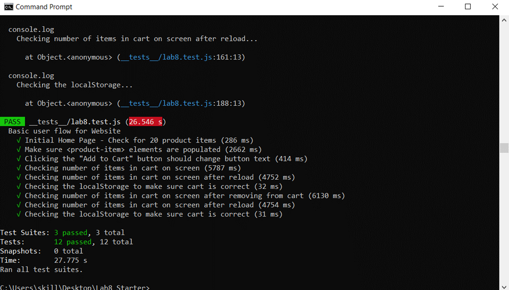
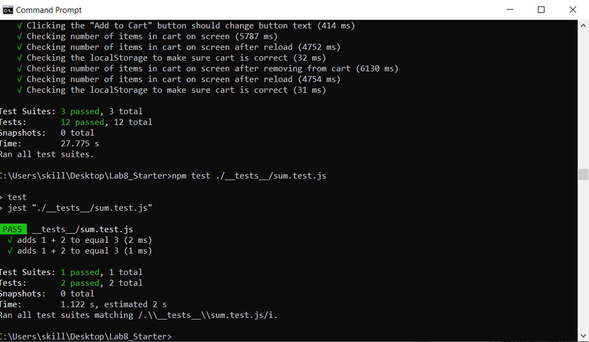

# Lab 8

### Group Members
- Steven Shoemaker

### Q & A: Check Your Understanding

**1) In your own words: Where would you fit your automated tests in your Recipe project development pipeline?**

Ans: *1. Within a Github action that runs whenever code is pushed*

This creates a workflow that ultimately requires less work put into it, and leaves less room for human error (IE People may forget to run the tests, use an incorrect command, etc). In theory, it also prevents risk from bad code being pushed (IE reject commits that contain errors). I would argue that occasionally running a manual test isn't a bad idea, though that would be *in addition* to automated testing.

**2) Would you use an end to end test to check if a function is returning the correct output?**

Ans: No.

That type of small-scale code-based testing is better saved for unit tests.

**3) Would you use a unit test to test the “message” feature of a messaging application? Why or why not? For this question, assume the “message” feature allows a user to write and send a message to another user.**

Ans: No. Unit tests measure small, independent components of an application. I would assume there are a lot of moving parts involved in sending a message (composing the message, the effect of the send button, any API involved in transmitting that data, etc), a unit test should be too narrow to measure what specifically may have gone wrong in the event of an error. This taks is more suited to E2E testing.

**4) Would you use a unit test to test the “max message length” feature of a messaging application? Why or why not? For this question, assume the “max message length” feature prevents the user from typing more than 80 characters.**

Ans: Yes. Making sure a textbox contains no more than a set number of characters is a very small-scale operation, which is exactly the type of thing unit tests are designed for. No other aspect of the application really relies on this number specifically - it is an independent and small feature.

### Screenshots

(All SCs can be found in the screenshots top-level directory)

Lab 8 Tests

Sum Tests

Unit Tests

(I might forget to update this, check the screenshots folder if it's not here.)